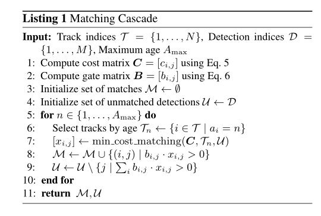

# 特殊情况下交通检测

[TOC]


## 1 天气分类算法

 情况下的天气分类算法需要借助气象台等其他媒介获取天气数据分析，在这种情况下需要进行较为复杂的观测，许多的数据也无法实现实时的更新。尤其是在视频监控领域，需要对小范围的地点进行天气的判断，这种情况下直接通过视觉识别分类天气往往更为可靠便捷。通过实时获取的图像进行天气分类已经是一个非常成熟的研究方向，下面的分类算法主要参照的是论文[多类别天气图俩分类算法研究](https://kns.cnki.net/kcms/detail/detail.aspx?dbcode=CMFD&dbname=CMFD202001&filename=1019189737.nh&v=i9rfN7z0fTOyJSai5PKyMRWb%25mmd2F5AN0q58DgzJBuXGQxNwpFP3XhVtiWKWDZHb1y5S)的第四章节，分别提取图像的两个特征：雾度特征和饱和度特征，然后通过机器学习分类器进行分类训练。

### 1.1 天气分类图像数据集预处理

做一个模型最开始的一步自然是建立一个好一点的数据集，这里首先收集了一下相关的数据集，并通过脚本进行一定的分类处理，对应的天气分类在对应的文件夹中，读取图片时，直接根据读取的文件目录获取图片的对应天气标签，例如雨天的图像存放在`rainy`文件夹下。

这里收集到的天气图像数据集总共有以下几个：

* Multi-class Weather Dataset
* Multi-class Weather Image
* Two-class Weather Image

每个数据集组织的形式不同，可分的类也不同，首先将这些数据集按照本文要求的类别整合为需要用到的数据集，命名为MWD，文件夹下建立对应的天气分类目录，将收集到数据集中的数据放到对应的目录下，方便后续处理，后续处理全放在一个文件夹下，文件的组织形式如下所示：

```html
├──datasets
     |———MWD
          |————cloudy
		  |————rainy
		  |————sunny
```

**这部分的代码实现在`codes/weather-image-preprocess.ipynb`**, 发送的数据集已经处理好了，这部分代码不是很重要，可以粗略地看一下

### 1.2 图像特征提取

为了获取图像中的天气特征，通过两种方法结合，雾度特征和饱和对比度特征识别，这部分的代码实现在`codes/weather-image-to-numpy.ipynb`中，主要是提取图像的特征，然后转换为numpy形式的二进制文件，方便后续直接读取处理，数据集很大，运行**十分缓慢**

#### 1.2.1 雾度特征

因为雨天，雾霾天等天气的不同会导致湿度不同而造成天气图像的雾度不同，在室外拍摄的图像，雾浓度的不同在暗通道中颜色就越暗，像素点的值就越小，通过暗通道值的大小可以很好地反映不同天气图像之间的差异。暗通道计算的方法如下：

将每张天气图像划分为4x50的无重叠的块，然后使用这些区域中暗通道的均值来形成200维向量: 
$$
J^{dark}(x)=\min_{c\in\{r,g,b\}}(\min_{y \in \Omega(x)}(J^C(y)))
$$

其中，$J^C$是图片J的颜色通道，$\Omega(x)$是以x为中心的局部区域，$J^{dark}$即为图片$J$的暗通道值，对三个颜色通道计算得到的暗通道值求均值，得到200维的向量。

#### 1.2.2 饱和对比度特征

图像的饱和对比度与照明无关，不同天气下拍摄的室外图像会表现出不同的全局和局部和对比度的特性，因此图像饱和对比度可以表示在各种照明条件下的不同天气图像。通过以下公式计算每个像素的归一化饱和度，然后计算图像归一化饱和度的直方图，形成100维特征向量，作为天气图像的全局特征。
$$
S(x,y)=\frac{S_{x,y}-min(S_I)}{max(S_I)-min(S_I)}
$$

**关于饱和度，HSV, RBG相关的知识**

RGB是我们最常见到的一种颜色表示形式，RGB 颜色空间利用三个颜色分量的线性组合来表示颜色，任何颜色都与这三个分量有关，而且这三个分量是高度相关的，所以连续变换颜色时并不直观，想对图像的颜色进行调整需要更改这三个分量才行。

自然环境下获取的图像容易受自然光照、遮挡和阴影等情况的影响，即对亮度比较敏感。而 RGB 颜色空间的三个分量都与亮度密切相关，即只要亮度改变，三个分量都会随之相应地改变，而没有一种更直观的方式来表达。但是人眼对于这三种颜色分量的敏感程度是不一样的，在单色中，人眼对红色最不敏感，蓝色最敏感，所以 RGB 颜色空间是一种均匀性较差的颜色空间。如果颜色的相似性直接用欧氏距离来度量，其结果与人眼视觉会有较大的偏差。对于某一种颜色，我们很难推测出较为精确的三个分量数值来表示。

所以，RGB 颜色空间适合于显示系统，却并不适合于图像处理。

基于上述理由，在图像处理中使用较多的是 HSV 颜色空间，它比 RGB 更接近人们对彩色的感知经验。非常直观地表达颜色的色调、鲜艳程度和明暗程度，方便进行颜色的对比。

HSV 表达彩色图像的方式由三个部分组成：

- Hue（色调、色相）
- Saturation（饱和度、色彩纯净度）
- Value（明度）

用下面这个圆柱体来表示 HSV 颜色空间，圆柱体的横截面可以看做是一个极坐标系 ，H 用极坐标的极角表示，S 用极坐标的极轴长度表示，V 用圆柱中轴的高度表示。


> 因为数据集较为庞大，为了方便后续的处理，先通过特征提取得到图片的特征以及其对应的标签，然后保存为numpy形式的二进制文件，方便后续直接读取处理

### 1.3 天气特征分类

利用机器学习的方法分类天气，这部分的代码在`codes/Weather-image-recognize.ipynb`中实现，总共的数据集标签组成如下所示：


| 分类 | 个数 | 占比 |
| :-: | :-: | :-: |
| cloudy | 20302 | 39.98% |
| rainy | 10214 | 20.11% |
| sunny | 20252 | 39.89% |

> 主要是其中一个数据集two-class Weather Image没有`Cloudy`分类，所以比起其它类少了约1万张图片

​        利用三种分类器对其分类，得到的准确率如下表格所示：


| 分类器(Classifier) | 准确率(Accuracy) |
| :-: | :-: |
| 决策树(DecisionTree) | 65.944% |
| 随机森林(RandomForest) | 74.690% |
| 极端梯度提升(XGBoost) | 74.748% |

​       其中`XGBoost`在`n_eatimators=207`时得到最好的准确率，这部分没有什么可以描述的算法，有关于XGBoost的介绍可以参考这篇论文[XGBoost: A Scalable Tree Boosting System](XGBoost: A Scalable Tree Boosting System)

## 2 图像增强

​    处理的天气图像主要是一下几个分类：

* 阴天
* 雨天
* 晴天

​    需要着重处理的便是雨天的图像，这部分的代码在`codes/Weather-image-transform.ipynb`中实现。

### 2.1 阴天图像处理

​       阴天的图像可以看做是一种低照度的图像，其对比度较低、动态范围较小、颜色容易产生失真，使得低照度图像相较于正常光照的图像在实际使用中利用价值较低，极大地限制了机器视觉应用范围和使用场景。夜间车辆行驶过程中采集到的图像质量较差，图像的缺陷基本以光照不足为主，同时由于车灯与路灯等非自然光源的影响，图像各区域光照不均，并且图像含有大量的噪声。低照度图像因此需要低照度图像增强算法进行增强，以满足实际使用的需求。常用的低照度图像增强算法有直方图均衡化、gamma 校正、同态滤波、Retinex 等算法。阴天处理的图像算法主要参考的是这篇论文[低照度图像增强与车辆识别技术研究](https://kns.cnki.net/kcms/detail/detail.aspx?dbcode=CMFD&dbname=CMFD202101&filename=1020757834.nh&v=QHy5NL0T0AfnBqb4mygqPzC576hvf4IO5P3oEJ%25mmd2FmE%25mmd2F7GFjUx6L6j%25mmd2FLHP7zINlsqb)的第二章节，主要实现了以下的几个方法：

#### 2.1.1 直方图均衡化

字图像灰度级分布的信息按照灰度值的大小，统计其出现的频率，并在直方图上进行表示就是图像的灰度直方图。灰度直方图反映了数字图像的概貌特征。直方图均衡化是通过某种变换，将数字图像中的像素值进行映射更新，使得图像中的像素值在灰度直方图中分布均匀。直方图均衡化可以提高图像的动态范围、增加图像的对比度、增强图像的细节信息。 

记输入的数字图像记为 $O$ ，其直方图分布为 $H_O(r)$ ，处理后的图像记为 $N$ ，其直方图分布为 $H_N(r)$ 。直方图均衡化是通过一个单调非线性的映射函数 $f$ ，将数字图像 $O$ 变化为均衡化图像 $N$ 。其中映射关系如下式子所示：
$$
r_n = f(r_0) \\
r_n+\Delta r_n = f(r_0 + \Delta r_0)
$$
本文中主要处理的是彩色图像，需要将图像转换为从`BGR`通道转换为`HSV`颜色空间，并单独在V通道处理，然后再将直方图均衡化处理的V通道与之前的HS通道合并得到转换后`HSV`颜色空间，然后再将`HSV`颜色空间的图像转换为`BGR`颜色空间。

> * `opencv`读取图像的颜色空间是`BGR`的顺序，和参见的`RGB`顺序有所不同，例如`matplotlib.pyplot`，所以在代码中画图可以看到有这样的形式`img[:, :, -1]`，这是将图像的颜色空间反转，以免出现绘图结果颜色失真

#### 2.1.2 gamma矫正

由于 CRT(阴极射线显像管)显示器输出图像的亮度并不随着输入电压发生线性变化，导致无法较好的重现采集设备采集的图像。实验发现输入电压的指数要高于电子流的指数从而导致了图像的失真，为了重现采集的图像，需要对 CRT显示器进行一定的补偿以还原图像。这种补偿方式后来被广泛用于图像增强过程中，被称为gamma 校正(Gamma Correction，伽玛校正)。gamma 校正指的是对图像的gamma 值进行编辑，进而对图像进行非线性的调整，使图像呈现出预期效果。

gamma矫正的具体步骤如下：

1. 对输入的图像进行归一化，例如如果图像的色深是8位，那么 $2^8 = 256$，8位二进制码可以表示的无符号位最高为255，所有像素值除以255就可以得到0-1的实数，完成归一化，如下式子所示：

$$
f(I) = \frac{X(I)}{2^b-1}
$$

​		其中 $X(I)$ 为输入图像， $f(I)$ 为归一化之后的图像， $b$ 为图像的色深

2. 预补偿，对每一个像素值都求 $\gamma$ 次指数，用新得到的数据代替原来的像素值。由于原始像素值都是 0 到 1 之间的实数，而 $\gamma$ 的值为大于零的实数。因此预补偿之后的像素值依然保持在 0 到 1 之间，如以下公式所示：

$$
Y(I)=f(I)^r
$$

3. 反归一化，反归一化与第一个步骤中正好相反，将补偿后的图像乘以255，使其重新转化为 0-255 之间的整数(对于非整数通过四舍五入化为整数)。完成反归一化，得到的图像即完成 gamma 校正后的图像，如以下公式所示：

$$
Y(I)=gaamma(I) \times (2^b - 1)
$$

​		 其中 $Y(I)$ 为 gamma 矫正后的输出图像，下图为gamma矫正曲线


实现的代码很简单：

```
def gamma(img, r):
    return np.power(img/float(255), r)
```

gamma 校正时，当 $\gamma<1$ ，图像的整体亮度提高，同时低灰度值区的动态范围变大，进而增强了图像低灰度值区域的图像对比度；当 $\gamma > 1$ 时，图像的整体亮度降低，高灰度值区的动态范围变大，进而增强了图像高灰度值区域的图像对比度。因此对于所研究的低照度图像增强算法，选择 $\gamma<1$ 的曲线对输入图像进行非线性变换可以一定程度地增强图像。

#### 2.1.3 同态滤波

同态滤波的公式太多，这里就不赘述了，可以直接查看这篇论文对应的章节，代码实现了两种同态滤波，巴特沃斯滤波和高斯滤波

### 2.2 雨天图像处理

雨天图像处理参考论文[图像去雨算法及其在车道线检测中的应用](https://kns.cnki.net/kcms/detail/detail.aspx?dbcode=CMFD&dbname=CMFD202101&filename=1020330611.nh&v=6ZVDxqBu%25mmd2FvpJXInnjo9LBIgz6ScjLEfOv3Ok5v5ZJfc2AJF%25mmd2B5m9axOzwy%25mmd2BPKgwCk)和[恶劣天气条件下的图像复原算法研究](https://kns.cnki.net/kcms/detail/detail.aspx?dbcode=CDFD&dbname=CDFDLAST2021&filename=1020309974.nh&v=hx8uFXDGP7wglJcQmhp23igS%25mmd2BYG6A29VSOtuw%25mmd2BIhCPZQBVq8PAF8qvqu5XoDkISy)的，主要的方法如下：

#### 2.2.1 基于稀疏编码字典学习和分类器的去雨方法

这部分做了下好像没啥效果，决定尝试一下神经网络的方法

#### 2.2.2 线性模型去雨方法

基于线性模型去雨的算法主要参照的是这篇论文[恶劣天气条件下的图像复原算法研究的](https://kns.cnki.net/kcms/detail/detail.aspx?dbcode=CDFD&dbname=CDFDLAST2021&filename=1020309974.nh&v=hx8uFXDGP7wglJcQmhp23igS%25mmd2BYG6A29VSOtuw%25mmd2BIhCPZcXKMBJuhweg%25mmd2BlvfOT0dX9)的第二章节，通过建立雨光照物理模型来处理雨像素，算法的描述如下所示：

**Input:** 输入雨图像I

**Step-1**

1. 通过以下方程得到雨的位置图谱 $B$
$$
p>\hat{P}^{(k)}+\mu \\
\hat{P}^{(k)}=\frac{\sum_{(m,n) \in w^{(k)}}P_{m,n}}{|\omega ^{(k)}|}, k=\{1, 2, 3, 4, 5\}
$$
即如果像素 $P$ 的强度大于包含他的一个图像块中所有像素强度的均值，则像素 $P$ 被认为是候选的雨像素，检测结束得到一个二进制的图谱 $B$ 来表示检测的结果，其中 $0$ 表示雨像素， $1$ 表示非雨的像素

2. 通过以下方程把 $RGB$ 空间变换到 $u-v$ 空间
$$
\left\{
    \begin{matrix}
    u_{i,j} = \frac{2C_{i, j} -p_{i,j}^G -p_{i,j}^B}{C_{i,j}} \\
    v_{i, j} = \max\{\frac{C_{i,j}-P_{i,j}^G}{C_{i,j}}, \frac{C_{i,j}-P_{i,j}^B}{C_{i,j}} \} 
    \end{matrix}
\right.
$$
其中:
$$
C_{i,j}=\frac{1}{3}(P_{i,j}^R+P_{i,j}^G+P_{i,j}^B)
$$
具有中性颜色的像素将会聚集在原点(0,0)附近，因此，转换到 $u-v$ 空间后形成 $2-D$ 向量，其中 $2-D$ 向量幅度大于预设值 $\epsilon$ 的候选雨像素为错误检测的非雨像素

3. 通过 $\epsilon$ 在 $u-v$ 空间修改位置图谱 $B$

在 $u-v$ 空间中大于 $\epsilon$ 的那些候选雨像素为错误检测的非雨像素，将这些像素在位置图谱 $B$ 中对应的位置修改为1

**Step-2**

4. **for** $ X \in \{R, G, B\} $ **do** 

    **for** 对每个检测的雨像素 $(i, j)$ **do**  
    		通过以下方程1和方程2训练 $\{\alpha_{ij},\beta_{ij}\}$
        	通过方程3计算得到 $s_{ij}$
    **end for**

   **end for**
   

**Output:** 去雨的图像 $S$
$$
\alpha=\frac{\frac{1}{k} \sum_{k=1}^K d_{k q_k} -\hat{d}_{\hat{q}}}{\frac{1}{k} \sum_{k=1}^K q_k^2 -\hat{q}^2 + \lambda}
$$

$$
\beta = \hat{d} -a\hat{q}
$$

$$
s=(p-\beta)/\alpha
$$

> 以上公式设计的相关参数设置参考 $\mu=0.01, \epsilon=0.08, \sigma=9, N=13, M=85, \lambda=0.01^2$

代码实现过程中主要是结合numpy矩阵的切片和广播特性，但是实在想不到好的逻辑方式优化代码，目前其运算缓慢，效果不是很好。

#### 2.2.3 神经网络

这部分参考的文献是[Image De-raining Using a Conditional Generative
Adversarial Network](https://arxiv.org/abs/1701.05957)，神经网络的架构参照的是其生成器的架构，建立的tensorflow模型各层的架构为：

```shell
Model: "model"
_________________________________________________________________
Layer (type)                 Output Shape              Param #   
=================================================================
input_1 (InputLayer)         [(None, 512, 512, 3)]     0         
_________________________________________________________________
conv2d (Conv2D)              (None, 512, 512, 16)      784       
_________________________________________________________________
max_pooling2d (MaxPooling2D) (None, 256, 256, 16)      0         
_________________________________________________________________
conv2d_1 (Conv2D)            (None, 256, 256, 32)      12832     
_________________________________________________________________
max_pooling2d_1 (MaxPooling2 (None, 128, 128, 32)      0         
_________________________________________________________________
conv2d_2 (Conv2D)            (None, 128, 128, 64)      18496     
_________________________________________________________________
conv2d_transpose (Conv2DTran (None, 128, 128, 32)      18464     
_________________________________________________________________
up_sampling2d (UpSampling2D) (None, 256, 256, 32)      0         
_________________________________________________________________
conv2d_3 (Conv2D)            (None, 256, 256, 16)      12816     
_________________________________________________________________
up_sampling2d_1 (UpSampling2 (None, 512, 512, 16)      0         
_________________________________________________________________
conv2d_4 (Conv2D)            (None, 512, 512, 3)       435       
=================================================================
Total params: 63,827
Trainable params: 63,827
Non-trainable params: 0
_________________________________________________________________
```

模型的训练代码在`codes/derain-model-train.ipynb`实现，这部分的训练数据集在`datasets/derain/`中，其中`training`文件夹下的图片为训练的数据集，其余的是一些测试数据集，训练完成后的模型保存为 `models/model.h5`

> 为了适应视频处理，再次调整模型框架，训练了一个输入输出层形状为 $(1280 \times 720)$ 的模型，保存为`models/model720.h5`，方便直接输入视频提取的图片处理

测试神经网络的代码在`codes/derain-model-test.ipynb` 中实现，这里测试的数据集在 `datasets/derain/test_syn` 中，得到的测试结果如下：

* MSE 0.006927997932768085
* PSNR 21.593922505789816

绘制通过神经网络处理前后的对比图片，随机选择五张图片，分为三列显示，左边一列为没有雨的原图，中间为有雨的图片，右边一列的为神经网络处理后得到的去雨图片，得到的结果如下：


## 3 目标检测

目标检测方法参照的是[yolov5](https://github.com/ultralytics/yolov5)框架，对视频进行yolov5框架进行分析，得到检测物体的位置信息，然后通过[Deepsort](https://github.com/ZQPei/deep_sort_pytorch)进行跟踪得到对应物体特定的ID，然后计算相应时间下车辆移动的距离得到车速，关于yolov5结合Deepsort的使用可以参考[[Yolov5_DeepSort_Pytorch](https://github.com/mikel-brostrom/Yolov5_DeepSort_Pytorch)]

### 3.1 YOLOv5

#### 3.1.1 YOLOv5简介

YOLOv5是[ultralytics](https://github.com/ultralytics/yolov5)在yolov4的基础上改进得来的，比YOLOv4的主要提升是运行速度更快，模型更小，运行速度在测试平台提升到了120Fps，模型最小可以只有几MB，但是精度和yolov4相当，但是也有一些争议，开源社区的一些人认为YOLOv5不算是YOLOv5，只是稍微改进的YOLOv4，它的预测精度没有大的提升，只能说是YOLOv4的改进，没有资格延续YOLO的版本号，但是这个版本的算法确实对硬件的性能要求不高，运算速度可以基本达到实时的要求，所以选择这个版本的YOLO算法。

YOLOv5的实现有几个不同的版本，有的追求简洁快速，有的最近高精度，不同的模型版本的区别如下所示：

| Model                                                        | size | APval    | APtest   | AP50     | SpeedV100 | FPSV100 |      | params | GFLOPS |
| ------------------------------------------------------------ | ---- | -------- | -------- | -------- | --------- | ------- | ---- | ------ | ------ |
| [YOLOv5s](https://github.com/ultralytics/yolov5/releases)    | 640  | 36.8     | 36.8     | 55.6     | **2.2ms** | **455** |      | 7.3M   | 17.0   |
| [YOLOv5m](https://github.com/ultralytics/yolov5/releases)    | 640  | 44.5     | 44.5     | 63.1     | 2.9ms     | 345     |      | 21.4M  | 51.3   |
| [YOLOv5l](https://github.com/ultralytics/yolov5/releases)    | 640  | 48.1     | 48.1     | 66.4     | 3.8ms     | 264     |      | 47.0M  | 115.4  |
| [YOLOv5x](https://github.com/ultralytics/yolov5/releases)    | 640  | **50.1** | **50.1** | **68.7** | 6.0ms     | 167     |      | 87.7M  | 218.8  |
|                                                              |      |          |          |          |           |         |      |        |        |
| [YOLOv5x](https://github.com/ultralytics/yolov5/releases) + TTA | 832  | **51.9** | **51.9** | **69.6** | 24.9ms    | 40      |      | 87.7M  | 1005.3 |

YOLOv5s在Tesla-V100显卡上可以达到**2.2ms**处理一张图片的速度，即可以达到**455Fps**的处理速度，YOLOv5的几个不同的模型在COCO上训练测试得到的结果对比EfficientDet的效果如下图所示：


#### 3.1.2 YOLO原理

关于YOLO算法原理的参考的是这篇论文的第四章[Detection of concealed cracks from ground penetrating radar images based on deep learning algorithm](https://www.sciencedirect.com/science/article/pii/S0950061820339532#s0005)

YOLO是you only look once的简称，它是最流行的一阶段检测方法之一，在许多方面得到广泛的应用。这里使用的YOLOv5算法虽然是比较新的一个版本，但是主要还是YOLOv3算法的一个改进，它的检测原理和YOLOv3的检测原理和网络架构类似。

与两阶段检测网络的算法不同，YOLOv3将目标检测视为回归问题，并立即获得目标边界框和置信度。如图[7](https://www.sciencedirect.com/science/article/pii/S0950061820339532#f0035)所示，首先将输入图像划分为S×S网格。对于每个网格单元，都将对具有这些框的置信度的B个边界框进行预测。置信度可以反映网格单元中是否存在对象。此外，还可以预测对象的C类概率。

因此，对于整个图像，YOLO将预测编码为 $S \times S \times [B \times (4+1+C)]$ 张量，其中 $S \times S$ 表示网格的数量，$B$ 表示边界框的数量， $4 + 1$ 表示边界框 $(b_x, \quad b_y,\quad b_w,\quad b_h)$ 的坐标及其置信度 $(P_c)$，$C$ 表示 $C$ 类概率即 $(c_1)$。

边界框预测，利用维度作为锚定框来预测边界框，如果网格从图像左上角计算的偏移为 $(c_x, c_y)$ 且网格的宽度和高度分别为 $(p_w, p_h)$，那么预测可以计算如下所示：
$$
\left.\begin{matrix}
b_x = \sigma(t_x) + c_x \\
b_y = \sigma(t_y) + x_y \\
b_w = p_w e^{t_w} \\
b_h = p_h w^{t_h}
\end{matrix}
\right\}
$$
其中 $\sigma(x)$ 是 sigmoid函数，定义为：
$$
\sigma(x) = \frac{1}{1+e^{-x}}
$$
边界框预测示意图如下所示：


YOLOv3使用逻辑回归预测每个边界框的客观性得分。如果边界框先验与地面真值对象的重叠量大于任何其他边界框先验，则此分数应为1。如果先验边界框不是最佳边界框，但确实与地面真实对象重叠超过某个阈值，则该预测将被忽略。使用的阈值为0.5，并且YOLOv3在每个地面真实对象之前仅分配一个边界框。在边界框预测之后，每个框都可以使用多标签分类来预测边界框内的类。这里，二进制交叉熵(binary cross-entropy loss)损失用于类别预测。然后，可以使用非最大抑制（NMS）获得最终的检测结果，该非最大抑制用于删除冗余检测并找到最佳匹配。

#### 3.1.3 YOLO 网络架构

现代检测器通常由三部分组成：用于提取特征的主干，用于收集不同阶段的特征图的颈部以及用于预测目标类别和边界框的头部。YOLOv3的结构如下图所示。主要模块的组成和功能如下：


CBL（卷积（CONV），批处理归一化（BN）和leaky-ReLU）是一个基本模块，由卷积层，批处理归一化层和leaky-ReLU激活功能组成。CBL是YOLOv3网络中最常见的结构。

RES（残差）单元是用于使网络结构更深的残余结构。它的基本组件是CBL模块和一个实现张量直接叠加的加法层。同时，RES_N表示该残余块除零填充层和CBL模块外还包含n个RES单元。

concat层可以完成CBL模块和上采样层的张量拼接。concat层扩展了张量的尺寸，而add层却没有。

在骨干方面，该网络使用连续的3×3和1×1卷积层，并具有一些捷径连接以提高学习能力。由于RES单元功能的加深，卷积层数从YOLO版本2中的19个增加到53个。因此，它也被称为Darknet-53。这里，Darknet-53不使用完整的连接层。YOLOv3的颈部装有特征金字塔网络（FPN，可以解决特征提取中的多尺度问题。然后，它的头是YOLO，它也是检测器的预测部分，它从3种不同的尺度输出检测结果。

YOLOv3识别大中型目标很有效，但是YOLOv3无法有效识别较小的对象。通常，中小型目标的矩形区域分别小于32像素×32像素和96像素×96像素。然后，大目标的矩形区域大于96像素×96像素。经过多层之后，最后一层上几乎没有像素的小物体将无法显示。但是，YOLOv3仅检测到卷积输出的最后一层，这使这些对象难以识别。

YOLOv4遵循YOLOv3的主要架构，但是使用一些最新方法进行相应的修改。下图是改进得到YOLOv4的架构：


CBM（CONV，BN和Mish激活）模块和CBL模块都用于特征提取。两者之间的区别在于CBM的激活功能使用Mish而不是Leaky-ReLU。Mish是具有较高平滑度的自调节非单调神经激活功能。因此，Mish可以进一步提高泛化能力和分类精度。空间金字塔池（SPP）是一个空间金字塔池化层，主要将不同大小的卷积特征转换为具有相同长度的池化特征。CSP（中心和尺度预测）模块可以通过将低层特征分为两部分，然后融合跨层特征来增强CNN的学习能力。

与YOLOv3的主干网不同，YOLOv4的主干网是CSPDarknet53，它借鉴了基于Darknet53的跨阶段局部网络（CSPNet）的启发。由于CBM模块，该新网络可以减少计算，同时保持准确性。在脖子上，YOLOv4使用路径聚合网络（PANet）而不是YOLOv3中使用的FPN，它可以增强网络中的信息流。此外，尽管已在YOLOv3变体中使用了SPP，但它还是通过CSPDarknet53引入的。SPP显着增加了接收场，并分隔了最重要的上下文，但几乎不会降低操作速度。YOLOv4的头与YOLOv3的头几乎相同。因此，YOLOv4的架构由CSPDarknet53主干，SPP附加模块，PANet颈部和YOLOv3头组成。

在边框检测回归损失计算中，交并比(Intersection over Union, IoU)是最受欢迎的指标，该损失函数的计算如下式所示：
$$
\left.\begin{matrix}
IoU = \frac{B \cap B^{gt}}{B\cup B^{gt}} \\
Loss_{IoU} = 1-IoU
\end{matrix}
\right\}
$$
其中， $B^{gt}$ 是真实的边界框，而 $B$ 是预测的边界框， $B \bigcap B^{gt}$ 是预测边界框和真实边界框的交集，而 $B \bigcup B^{gt}$ 是预测边界框和真实边界框的并集，如下图所示：


但是，IoU损失仅在边界框重叠时起作用，在不重叠的时候 $B \bigcap B^{gt} = 0$，这样计算得到的损失为零，所以需要添加一个损失项来推广IOU损失:
$$
\left.\begin{matrix}
GIoU = IoU - \frac{|C \verb|\| (B \cup B^{gt})}{|C|} \\
Loss_{IoU} = 1-IoU + \frac{|C \verb|\| (B \cup B^{gt})}{|C|}
\end{matrix}
\right\}
$$
其中 $C$ 是能够包含 $B$ 和 $B^{gt}$ 两个边框的最小的一个边框，如上图(d)所示；$c \verb|\| B \cup B^{gt}$ 是 $C$ 减去 $B$ 和 $B^{gt}$ 的交集。

由于引入了惩罚项，因此在非重叠情况下，预测框将向目标框移动。尽管GIoU可以缓解非重叠情况下消失的梯度问题，但仍然存在一些局限性。例如，对于封闭边界框，GioU损耗将完全降级为IoU损耗。由于高度依赖IoU项，因此GIoU在经验上需要进行更多的迭代才能收敛，尤其是对于水平和垂直边界框。通常，GioU丢失无法在最新的检测算法中很好地收敛，从而导致检测不准确。

因此，提出了一种用于边界框回归的距离IoU（DIoU）损失，以克服GIoU损失的缓慢收敛。如上图(f）所示，DIoU考虑了两个边界框中心点之间的最小化归一化距离。另外，其功能可以定义为：
$$
Loss_{DIoU} = 1 - IoU + \frac{\rho^2(b, b^{gt})}{c^2}
$$
其中，$b$ 和 $b^{gt}$ 分别表示 $B$ 和 $B^{gt}$ 的中心，$\rho(\cdot)$ 是计算欧式距离，$c$ 是包含两个预测边界框最小边框的对角线。

基于GIoU和DIoU，提出了用于边界框回归的完整IoU（CIoU）损失，从而得到更快的收敛速度和更好的性能。然后，CIoU组合了三个几何度量，即重叠区域，中心点距离和长宽比，如下式所示：
$$
\left.\begin{matrix}
Loss_{CIoU} = 1-IoU + \frac{|C \verb|\| (B \cup B^{gt})}{|C|} + \alpha v \\
v=\frac{4}{\pi^2}(\arctan \frac{w^{gt}}{h^{gt}} - \arctan \frac{w}{h})^2 \\
\alpha = \frac{v}{1-IoU}+v
\end{matrix}
\right\}
$$
其中 α 是一个正的权衡参数，而 $v$ 衡量长宽比的一致性, $w^{gt}, h^{gt}$ 分别是 $B^{gt}$ 的宽度和高度。$w, h$ 分别是 $B$ 的宽度和高度。

YOLOv4使用CIoU作为评估指标，而不是YOLOv3中的IoU或GIoU。CIoU不仅考虑目标框与预测框之间的距离，而且在边界框回归中引入了诸如长宽比之类的几何因素，从而导致更快的收敛速度和更好的性能。

YOLOv5由初创公司Ultralytics直接提出，作者是YOLOv4中镶嵌数据增强的作者。由于两个版本之间没有本质区别，因此该版本的名称在业界仍引起争议。YOLOv5由PyTorch完全编译，而不是YOLOv4中使用的Darknet。因此，由于PyTorch的应用功能，YOLOv5具有更高的灵活性和生产率。YOLOv5还使用CSPDarknet主干，PANet颈部和YOLOv3头。激活函数在最后一个检测层中使用了S型函数，而不是YOLOv4中的Mish函数。对于损失函数，YOLOv5使用GIoU估计边界框损失。此外，YOLOv5还使用自动学习的边界框锚来调整和优化锚的选择。

结合YOLO模型的网络架构和检测原理，可以包括训练和检测过程，如下图所示：


训练期间YOLO的损失函数定义如下：
$$
Loss = Error_{coord} + Error_{ion} + Error_{cls}
$$
其中，$Error_{coord},\quad Error_{iou}, \quad Error_{cls}$ 分别表示预测边界框的误差、IoU和其他相关误差和分类误差。

YOLOv5的模型训练效果如下图所示，这里没有尝试训练这个模型，这个是这篇论文给出的训练过程的损失曲线和评价曲线等，你可以参考一下：


### 3.2 DeepSort算法

#### 3.2.1 DeepSort简介

这里参考的[Simple Online and Realtime Tracking with a Deep Association Metric](https://arxiv.org/abs/1703.07402)

DeepSort的核心思想主要分为两块，一块可以简单称为Deep，另外一个可以称为Sort，背后的算法支持分别基于深度学习模型与卡尔曼滤波，是典型的结合深度学习与传统方法的混合算法框架实现了比较稳定的跟踪效果。简单的工作原理示意图如下：


采用的是传统的单假设跟踪方法，用递归卡尔曼滤波和逐帧数据关联。

#### 3.2.2 轨迹跟踪和状态估计

假设跟踪场景定义在八维状态空间$(u, v, \gamma, h, \dot{x}, \dot{y}, \dot{\gamma}, \dot{h})$，这个空间包括边界框中心位置$(u, v)$，纵横比 $\gamma$，高度 $h$，以及它们在图像坐标中各自的速度。我们使用标准的卡尔曼滤波器，它具有匀速运动和线性观测模型，其中我们将边界坐标 $(u, v, \gamma, h)$ 作为物体状态的直接观测值。对于每个轨迹 $k$ ，我们计算自上次成功测量关联 $a_k$ 以来的帧数，该计算器在卡尔曼滤波器预测期间递增，并且当轨迹与测量相关联时重置为0。超过预定义的最大累积帧数时，可以认为是已经离开检测的场景，并且将其是轨迹中删除。对于不能与现用轨迹相关联的每个检测，启动新的轨迹假设，在前三帧中，这些新轨迹只是作为假设，如果前三帧内未有测量相关的轨迹，那么就删除这个假设的轨迹。

#### 3.2.3 分配问题

解决预测的卡尔曼状态和新到达的测量值之间的关联的传统方法是建立可以使用匈牙利算法解决的分配问题。在这个问题的表述中，我们通过结合两个适当的度量标准来整合运动和外观信息。

为了合并运动信息，我们使用预测的卡尔曼状态和新到达的测量值之间的(平方)马哈拉诺比斯(Mahalanobis, 马氏)距离:
$$
d^{(1)}(i,j)=(d_j - y_i)^T S_i^L{-1}(d_j-y_i)
$$
其中，$(y_i, S_i)$ 表示第 $i$ 个轨迹分布到测量空间的投影，$d_j$ 表示第 $j$ 个检测框的检测

马哈拉诺比斯距离通过测量检测距离平均轨道位置的标准偏差来考虑状态估计的不确定性。此外，使用该度量，通过以95%的置信区间对马氏距离进行阈值化，排除不太可能的关联是可能的，该置信区间是从逆 $\chi^2$ 分布计算的。我们用一个指标来表示：
$$
b_{i,j}^{(1)} = [d^{(1)}\leq t^{(1)}]
$$
如果第 $i$ 个轨道和第 $j$ 个检测之间的关联是可接受的，则评估为1。对于我们的四维测量空间，相应的马氏阈值是t(1)= 9.4877。

当运动不确定性较低时，马氏距离是合适的关联度量，而在我们的图像空间问题公式中，从卡尔曼滤波框架获得的预测状态分布仅提供了对象位置的粗略估计。特别是，未计算的相机运动会在图像平面中引入快速位移，使得马氏距离成为通过遮挡进行跟踪的相当不了解的度量。因此，我们将第二个度量标准集成到分配问题中。对于每个边界框检测，我们计算一个外观描述符。此外，我们为每个轨道 $k$ 保留最后 $L_k=  100$ 个相关联的外观描述符 $R_k=\{ r_k^{(i)} \}_{k=1}^{L_k}$。然后，我们的第二个度量测量外观空间中第 $i$ 个轨道和第 $j$ 个检测之间的最小余弦距离:
$$
d^{(2)}(i,j)=\min \{ 1-r_j^T r_k^{(i)}|r_k^{(i)}\in R_i\}
$$
同样，我们引入了一个二进制变量来指示相关性这个度量，表征关联是否被接受：
$$
b_{i, j}^{(2)}=[d^{(2)}(i,j) \leq t^{(2)}]
$$
并且我们在单独的训练数据集上为该指标找到合适的阈值。在实践中，我们应用预先训练的CNN来计算包围盒外观描述符。第2.4节描述了该网络的体系结构。结合起来，这两个指标通过服务于分配问题的不同方面而相互补充。一方面，马哈拉诺比斯距离提供了基于运动的可能物体位置的信息，这对于短期预测特别有用。另一方面，余弦距离考虑了在长期遮挡后，当运动的辨别能力较弱时，对恢复身份特别有用的外观信息。为了建立关联问题，我们使用加权和来组合两个度量:
$$
c_{i,j}=\lambda d^{(1)}(i,j)+(1-\lambda)d^{(2)}(i,j)
$$
其中，如果关联在两个指标的选通区域内，我们称之为可接受的关联：
$$
b_{i,j}=\prod_{m=1}^2 b_{i,j}^{(m)}.
$$

#### 3.2.4 级联匹配

我们引入了一个级联来解决一系列子问题，而不是解决全局分配问题中的测量-跟踪关联。为了激励这种方法，考虑以下情况:当一个对象被遮挡了较长的时间，后续的卡尔曼滤波器预测增加了与对象位置相关的不确定性。因此，概率质量在状态空间中扩散开来，观测可能性变得越来越大。直观地说，关联度量应该通过增加测量到轨道的距离来说明这种概率质量的分布。与直觉相反，当两条轨道竞争相同的检测时，马哈拉诺比斯距离倾向于更大的不确定性，因为它有效地减少了任何检测的标准偏差到投影轨道平均值的距离。这是一种不受欢迎的行为，因为它会导致轨道碎片增加和轨道不稳定。因此，我们引入了一个匹配级联，优先考虑更常见的对象，以编码我们的关联可能性概率分布的概念。



上图概述了我们的匹配算法。作为输入，我们提供了一套跟踪测试和检测D指数以及最大年龄 $A_{max}$ 。在第1行和第2行，我们计算关联成本矩阵和可容许关联矩阵。然后，我们对轨道年龄 $n$ 进行迭代，以解决年龄增长的轨道的线性分配问题。在第6行中，我们选择在最后 $n$ 帧中没有与检测相关联的轨迹子集 $\tau_n$ 。在第7行中，我们解决了 $\tau_n$ 和不匹配检测 $u$ 中轨道之间的线性分配。

在第8行和第9行，我们更新了匹配和不匹配检测的集合，并在第11行完成后返回。注意，这种匹配级联优先考虑较小年龄的轨道，即最近看到的轨道。在最后一个匹配阶段，我们在年龄 $n=1$ 的未确认和不匹配的轨迹集合上运行原始SORT算法[12]中提出的联合关联上的交集。这有助于解决突然的外观变化，例如，由于静态场景几何形状的部分遮挡，并增加对错误初始化的鲁棒性。

### 3.3 检测实现

检测的实现是逐帧读取视频，得到图片，然后识别图片上的车辆并进行跟踪，计算其经过测速区域的时间得到对应的车速。

首先通过YOLOv5模型得到图像中车辆的位置信息，YOLOv5返回的是信息是一个多层嵌套的数据，这里只需要其中的车辆信息，遍历获取的方框，如果方框的label信息为2，即检测到的是方框才对这个方框进行后续的处理，否则跳过。

然后将YOLOv5检测得到的物体信息输入DeepSort模型，Deepsort模型根据这些信息匹配之前检测的物体，得到车辆的跟踪，DeepSort返回跟踪的车辆都有一个特定的ID来唯一表示该车辆。

然后是对车辆的测速，对DeepSort处理后的信息遍历，记录车辆在测速区域的帧数，然后换算为时间，之后就可以得到车速。

拥堵和超速检测的实现用的思路比较简单，超速的检测就是如果一辆车测得速度超过阈值`speedThresh`则标记为overspeed，否则为正常。拥堵的检测是首先设定一个速度阈值`vthresh` ，如果车辆速度低于该阈值，可认为是慢速车辆，如果慢速车辆超过当前车道车辆的一半或者其他比值，可认为当前车道拥堵；为了防止车辆过于拥堵，长时间没有车辆通过测速区域，即没有检测到车速，添加了另一种判断是当前检测到车道上的车辆数目大于一个设定的阈值`carthresh`也会认作是拥堵。


演示的视频可以参考`img/car_detect.mp4`

## 4 Gui界面实现

gui的初步设计思想是视频读取，显示分类结果，图像处理结果和检测和追踪结果，车速，特殊路况（超速和拥堵）检测结果，同时加入时间戳，进行分类存储。

Gui的实现是借助python的Tkinter模块实现的，将之前验证的代码都按照功能分类集成在不同的文件写成类的形式，新增的文件及说明：

* `carDetectGui.py` 这是Gui的主程序，实现了界面的初始化，并在该代码中调用其他的类实现相应的功能，**想要查看Gui，直接运行该文件**
* `weatherAna.py` 关于图像天气分类和处理的相关算法集成的类
* `image_transform.py` 图像增强的算法集成的类，包括阴天和雨天图像处理的方法
* `cardetect.py` 车辆检测的算法，包括yolov5+deepsort实现的车辆跟踪，车辆测速，交通拥堵检测等

程序运行的主界面如下所示：


这是最开始没有选择文件的界面，点击**从左到右第二个按钮**，选择视频文件，就可以实现视频测速，效果如下图所示：


测试运行的视频在`img/guitest.mp4`中可以查看

## 5 代码相关环境配置说明

主要的安装模块一时半会也不太好整理，图像分类需要的是机器学习相关的科学计算库：

* numpy
* scikit-learn
* xgboost
* matplotlib
* opencv-python3

关于之后的深度学习主要需要的则是pytorch-gpu和tensorflow-gpu以及cuda和cudnn，关于这些的配置和个人电脑配置环境相关，请自行根据电脑相关环境配置，关于windows上搭建深度学习的环境，本人不是很了解。

> 在运行`derain-model-train.ipynb`这个程序中可能出现报错提示，有两个可能：
>
> * cuda和cudnn环境配置不正确，请查看相关博客测试cuda和cudnn是否安装成功，且当前安装的tensorflow和pytorch支持对应版本的cuda和cudnn
> * 显存爆满，深度学习的数据量较为庞大，利用计算机显卡运算，深度学习框架会将数据导入显卡中，如果显存不够大可以尝试调低`batch_size`。同样地，还有一种可能是，程序运行中中断运行，退出错误，python还占着之前分配的显存，导致当前程序无法获取显存空间，可以使用命令行`nvidia-smi`查看当前占显存较多的程序进程，并使用相关命令杀死进程`kill -9 pid`，其中`pid`为你想杀死的进程。